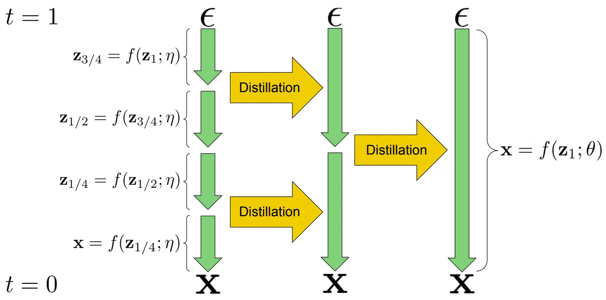
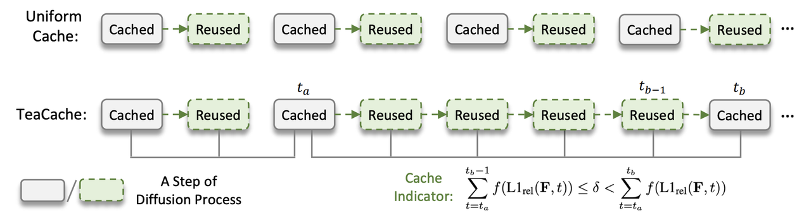
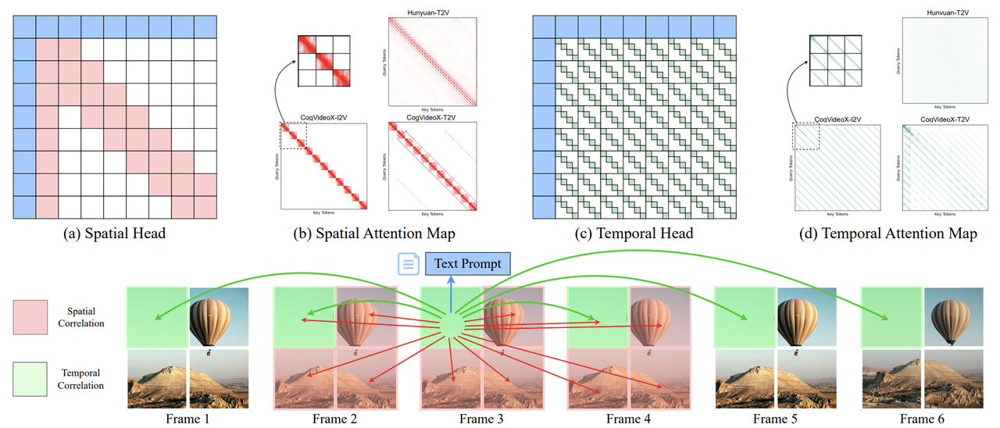

**This post assumes some basic familiarity with diffusion models.**

## Introduction

I stumbled across [this tweet](https://x.com/TheInclusionAI/status/1977653483353559105) which introduces an [inference framework for diffusion language models](https://github.com/inclusionAI/dInfer).

It feels like most people are concentrated on language model inference and serving [insert source here]. Where are the people thinking about other types of models?

Fortunately, the recent [release of Sora 2](https://openai.com/index/sora-2/) has found success within mainstream audiences. Its release marks a paradigm shift, redefining content creation as an industry and throwing generative video models into the limelight. An interesting statistic: the *[Sora app hit 1 million downloads in less than 5 days](https://x.com/billpeeb/status/1976099194407616641), faster than ChatGPT did*. As user demand continues to grow, it's worth considering: what happens at 10 million? 100 million?

Video models are the future - and will come to dominate over the next decade outside of generative media ("AI slop"). One clear use case is in world models - action-conditioned video generation models. These models learn the complexities of the real world and can envision several futures based on different possible actions. The use of these models will allow us to scale up robotics simulation and evaluation, paving the way towards general purpose intelligent robots.

*Robotics world model.* source: [1X](https://www.1x.tech/discover/1x-world-model)

Massive effort and resources have been poured into efforts to serve autoregressive transformer-based models at scale. There has been work on [model research](https://arxiv.org/abs/1911.02150), [research-engineering for serving](https://arxiv.org/abs/2309.06180), [engineering platforms for deployment](https://arxiv.org/abs/2407.00079), and [custom hardware](https://arxiv.org/abs/1704.04760). Inference engines like [SGLang](https://github.com/sgl-project/sglang) have been *co-designed specifically for next-token prediction*, squeezing out performance with optimizations such as KV caching, continuous batching, speculative decoding, chunked prefill, prefix caching, P/D disaggregation, and an attention engine and efficient kernels through [FlashInfer](https://github.com/flashinfer-ai/flashinfer).

However, at the time of writing, there is a limited amount of publicly available resources on how to think about video model serving and inference.

In this series, we'll cover foundational works to help where we are today, and consider what the future of serving video models at scale might look like.

**In this post, I'll discuss model-side optimizations for diffusion (transformer)-based models.**

## Model Optimizations
### Step Distillation
In early 2022, Tim Salimans and Jonathan Ho proposed **progressive distillation** [1]. This algorithm starts with a teacher model with a large number of sampling steps (the paper's experiments use $1024/8192$). Iteratively, the model is distilled into a "faster" student model with half the number of required sampling steps, eventually reaching as few as $4$ steps. Each time, the *student learns to predict the output of two steps of the teacher*.

*Figure 1. Progressive distillation example, 4-step sampler -> 1-step sampler.* source: [1]

This idea is fairly intuitive, however, I'd encourage you to check out the paper to understand the proposed alternative parameterizations ($x$, $\epsilon$, and $v$ prediction) and the underlying math.

### CFG Distillation
**Classifier-free guidance** (CFG) [2], proposed in 2022, is a technique to *increase sample quality at the cost of diversity*. By specifying a guidance weight ($w$), we can interpolate ($w \lt 1$) between the conditional and unconditional distributions - and extrapolate ($w \gt 1$) to push generations further towards the conditioning signal.

*Figure 2. CFG with different weights on SDXL.*

During training, conditioning (e.g. text prompt) is randomly dropped with some probability (typically $10\\%$ of the time). This allows the model to learn both conditional (prompt-conditioned) and unconditional ("null prompt") behavior in the same network.

At inference, we evaluate the model twice per diffusion step: once with the prompt and once with the null prompt. This provides both the conditional and unconditional predictions, which are then combined using $\hat{\epsilon} = \epsilon_{\text{uncond}} + w \cdot (\epsilon_{\text{cond}} - \epsilon_{\text{uncond}})$ (Eq. 6 in [2]) where $\epsilon_{\text{cond}}$ and $\epsilon_{\text{uncond}}$ are the noise predictions for the conditional and unconditional inputs, respectively.

*Figure 3. CFG-guided logits. The guided logits are pushed away from the unconditional.*

Running the model twice per step is computationally expensive, so practical implementations often run it once per step with double the effective batch size to compute both conditional and unconditional outputs in parallel. However, this results in increased memory usage (larger activations) and latency (as we are typically already compute-bound).

Ideally, we would like a model that directly predicts the guided output. Meng et al. (2022) [3] proposed and validated this idea of "**guidance distillation**", demonstrating its compability with progressive distillation. The key tradeoff is that the distilled model is tied to a specific guidance weight $w$ used during training, losing flexibility at inference time. In practice, this is acceptable since we typically use a single fixed guidance weight (usually in the range of $5\text{-}8$).

### High-Compression VAE
Modern video models are **latent diffusion models** (LDMs) [4]. LDMs allow the diffusion network - including architectures such as [DiT](https://arxiv.org/abs/2212.09748) and [RFT](https://arxiv.org/abs/2403.03206) - to operate on compressed latents, which *significantly reduces training and inference compute requirements*. DC-AE (2024) [5] explores high spatial compression ratios of up to $64\times$ (compared to conventional $8\times$ compression), further reducing the computational workload for the diffusion network.

Without diving too deep into the technical contributions of the paper, we can still understand the value of higher-compression VAEs as follows. In transformer-based video models, the sequence length directly depends on the number of frames and spatial resolution of the VAE latent output, such that $S \propto T \times H \times W$, where $H$ and $W$ are the height and width of the compressed latent map.

*Figure 4. Videos are VAE-encoded into a latent space, then patchified into a 1D sequence.* source: [OpenAI Sora](https://openai.com/index/video-generation-models-as-world-simulators/)

Compared to previous $8\times$ compression methods, DC-AE's $64\times$ compression reduces the sequence length by $64\times$ (due to an $8\times$ increase in both height and width compression), resulting in up to a $4096\times$ reduction in the quadratic attention computation.

### Timestep Caching
TeaCache [6], proposed by Liu et al. in 2024, is a training-free method that accelerates diffusion model inference. Diffusion caching methods aim to *reduce the number of computed sampling steps by reusing intermediate outputs*.

*Figure 5. Diffusion caching strategies. TeaCache selectively caches intermediate model outputs.* source: [6]

Most prior training-free methods focus on reusing intermediate features, which still requires some recomputation. In contrast, the Timestep Embedding Aware Cache (TeaCache) directly reuses intermediate model outputs by leveraging the strong correlation between a model's inputs and outputs. In particular, the authors found that timestep-embedding modulated noisy inputs (from AdaLN) exhibit similarities to corresponding model outputs. 

*Figure 6. Model outputs are strongly correlated with modulated noisy inputs, across different model families.* source: [6]

To determine when to cache, the authors fit polynomials between the modulated noisy inputs and model outputs. If the accumulated L1 distance between modulated inputs at two different timesteps is below a threshold, the outputs can be reused. This approach allows us to accelerate inference by $\gt 2×$ with no perceptual difference.

### Attention Sparsity
Sparsity has long been applied in deep learning to improve computational efficiency and reduce memory usage.

[StreamingLLM (2025)](https://arxiv.org/abs/2309.17453) is a recent training-free framework for LLMs which utilizes a variant of [Sliding Window Attention (SWA)](https://arxiv.org/abs/2004.05150), a **sparse attention** approach, to *enable generalization to infinite sequence lengths*. The authors found that alongside a dynamic sliding window, *retaining the KV of initial tokens was crucial during inference due to the emergence of the attention sink*. They further expand on this intuition in [their accompanying blog post](https://hanlab.mit.edu/blog/streamingllm).

Two recent works extend similar attention sparsity ideas to video generation models, also without requiring any additional training.

This past February, Sparse VideoGen (SVG) [7] proposed a method to sparsify attention computation by identifying spatial and temporal attention heads. The key intuition is that *attention heads tend to specialize*, attending to spatial dependencies (tokens within the same frame) or temporal dependencies (tokens at the same position across frames).

*Figure 7. Attention heads can be classified as spatial or temporal and sparsified using a corresponding mask.* source: [7]

The authors found that attention dominates computation in video diffusion transformer models. Thus, their method leverages spatial (block-wise) or temporal (slash-wise) attention masks to sparsify attention computation. These masks also include the text prompts and first frame, as they hold signficant attention scores for both types of heads.

Heads are assigned masks using an online profiling strategy: the system samples a subset of input rows and compares the results under spatial and temporal sparsity patterns against full attention. The pattern with the lower MSE relative to full attention is selected.

These masks are coupled with a layout transformation that transposes token-major tensors into frame-major tensors. This makes tokens across different frames contiguous in memory, necessary for efficiency on GPUs. Empirically, SVG achieves up to a $2.33\times$ end-to-end speedup with minimal quality degradation.

In the same month, AdaSpa [8] proposed a similar sparse attention method for video models that is training-free like SVG but requires no profiling. Instead, in less than 5% of full attention generation time, an online search is conducted to find an optimal sparse mask. The authors reported speedups of up to $1.78\times$, outperforming SVG on their benchmarks.

*Figure 8. AdaSpa performs an online search to find optimal sparse indices.* source: [8]

### Refiner

**Cascaded diffusion models** were introduced by Ho et al. [9] in 2021. A low-resolution image is first generated by a base model and then iteratively refined by subsequent super-resolution models, which provide progressively finer details.

*Figure 9. Cascaded models for higher-resolution image generation.* source: [9]

Each super-resolution model is conditioned on the lower-resolution input and produces higher-resolution variant. By splitting the task into stages, this approach reduces memory and compute requirements compared to generating the high-resolution image directly within a single, monolithic model.

The same team later applied the cascaded refinement idea to video in 2022 [10], using separate spatial and temporal super-resolution models.

Cascaded refinement has been a staple of modern video diffusion models, such as the open-source [Seedance model from ByteDance](https://arxiv.org/abs/2506.09113).

### Quantization

**Quantization** allows us to compress model weights and activations from *high-precision formats* (e.g. FP32, BF16) into *lower-precision formats* (e.g. INT8, FP4). It has been historically used in two main settings:
1. Weight-only quantization (WoQ) - *only model weights* are quantized.
2. Weight + activation quantization - *both weights and activations* are quantized.

Since WoQ does not quantize activations, it primarily targets memory-bound scenarios rather than low-precision computation. During the forward pass, low-precision weights are dequantized (upcast) to the same precision as activations (e.g. BF16, FP16), and computation proceeds in high precision. Thus, *WoQ reduces memory traffic but not arithmetic cost*.

WoQ provides inference speedups for LLM workloads. In the notoriously *memory-bound decode* step, each generated token requires reading from the full KV cache. In this case, throughput is limited by memory bandwidth rather than compute. Thus, *quantizing weights reduces bandwidth pressure* and can increase the "optimal batch size." For a deeper discussion of these dynamics, see [How To Scale Your Model](https://jax-ml.github.io/scaling-book/inference/#what-about-attention).

However, *video models tend to be compute-bound* (as they lack a KV cache). In this regime, WoQ offers little inference benefit. Instead, we turn to weight and activation quantization, which enables low-precision computation. By quantizing both weights and activations, *operations can be executed using hardware-accelerated low-precision kernels*, such as [NVIDIA's 8-bit Tensor Cores](https://www.nvidia.com/en-us/data-center/tensor-cores/), achieving higher throughput. Recent works explore **post-training quantization** (PTQ) for video diffusion models, requiring no additional training but sometimes needing a calibration phase to maintain accuracy.

One line of work focuses on methods that are model-architecture independent. SageAttention (2024) introduces a *plug-and-play quantized attention module* that directly replaces standard high-precision implementations [11]. SageAttention achieves a $2.1\times$ speedup over [FlashAttention2](https://arxiv.org/abs/2307.08691), with almost no perceptible quality degradation compared to full precision.

Another active direction involves mixed-precision schemes. ViDiT-Q (2024) [12] observed that aggressively quantizing all layers leads to quality loss, with certain "sensitive" layers acting as bottlenecks. The authors propose preserving these layers in higher precision while quantizing others, guided by a layer-wise sensitivity analysis.

*Figure 10. ViDiT-Q's mixed-precision scheme retains sensitive layers in higher precision while quantizing others.* source: [12]

Although ViDiT-Q applies this mixed-precision scheme only to weights, the idea naturally generalizes to WXAX settings (e.g. mixed-precision W6A6/W8A8 schemes). A similar mixed-precision strategy appears in [Seedream](https://arxiv.org/abs/2509.20427) (image) and Seedance.

SVDQuant (2024) [13] proposes a *low-rank decomposition-based approach to quantization*. The method first reduces quantization difficulty by migrating outliers from activations to weights using a technique like [SmoothQuant](https://arxiv.org/abs/2211.10438). Then, it decomposes each weight matrix into a low-rank component and a residual component and computation proceeds as

$$XW \approx \hat{X}L_1L_2 \textbf{ (16-bit low-rank)} + Q(\hat{X})Q(R) \textbf{ (4-bit residual)}$$

where the low-rank term (which is harder to quantize) is stored in higher precision (16-bit) and the resiudal term is quantized to lower precision (4-bit).

*Figure 11. SVDQuant decomposes weights into a high-precision low-rank component and a low-precision residual, reducing quantization error.* source: [13]

To enable efficient inference, the authors introduce the [Nunchaku](https://github.com/nunchaku-tech/nunchaku) engine, which fuses the low-rank Down/Up projections into the 4-bit kernel path. Without this kernel fusion, the *additional DRAM transfers and kernel invocations from the low-rank branch incur a $40\\%$ latency penalty*.

*Figure 12. Nunchaku inference engine fuses low-rank projections with the quantized branch, reducing memory traffic and latency overhead.* source: [13]

Although SVDQuant has primarily been demonstrated on image generation models, it offers a promising direction for future video quantization research.

## Conclusion
This post covered several model-side optimizations for optimizing diffusion transformer inference. In the next post, I intend to explore what it takes to serve these models efficiently at scale.

This was my first time writing something like this. I'd appreciate any comments or feedback, please reach out [over Twitter](https://x.com/jamespxu_)!
