**This post assumes the reader has basic familiarity with diffusion models and LLM serving.**

## Introduction

I stumbled across [this tweet](https://x.com/TheInclusionAI/status/1977653483353559105) recently.

Everyone is thinking about language model inference and serving [insert source here], but what about video models? The [release of Sora 2](https://openai.com/index/sora-2/) marks a paradigm shift, redefining content creation as an industry and throwing generative video models into the limelight.

**Video models are the future - and will come to dominate over the next decade**, aside from in generative media ("AI slop").

The clear use case is in world models - action-conditioned video generation models [1]. These models learn the complexities of the real world and can envision several futures based on different possible actions. The use of these models will allow us to scale up robotics simulation and evaluation, paving the way towards general purpose intelligence robots.

*Robotics world model.* source: [1]

The [Sora app hit 1 million downloads in less than 5 days](https://x.com/billpeeb/status/1976099194407616641), even faster than ChatGPT did. What happens at 10 million? 100 million? **Infrastructure for serving video models at scale is in its infancy, and approaches will continue to evolve as we bridge the gap between current and future demand.**

Massive effort and resources have been poured into efforts to serve autoregressive transformer-based models at scale. There has been work on model research ([2], [3]), research-engineering for serving ([4], [5]), engineering platforms for deployment ([6]), and custom hardware ([7]). Inference engines like SGLang have been co-designed specifically for next-token prediction, squeezing out performance through techniques like continuous batching, KV caching, prefix (radix) caching, PD disaggregation, and lower-level kernel optimizations via libraries like FlashInfer.

However, at the time of writing, there is a limited amount of publicly available resources on how to think about video model serving. In this post, we'll look at existing works to understand where we are today, and consider what the future of serving video models at scale might look like.

## Model Optimizations
### Step Distillation
In early 2022, Tim Salimans and Jonathan Ho proposed the idea of progressive distillation [8]. The algorithm starts with a teacher model with a large number of sampling steps (the paper's experiments use $1024/8192$). Iteratively, the model is distilled into a "faster" student model with half the number of required sampling steps, eventually reaching as few as $4$ steps. Each time, the student model learns to predict the output of two steps of the teacher model.

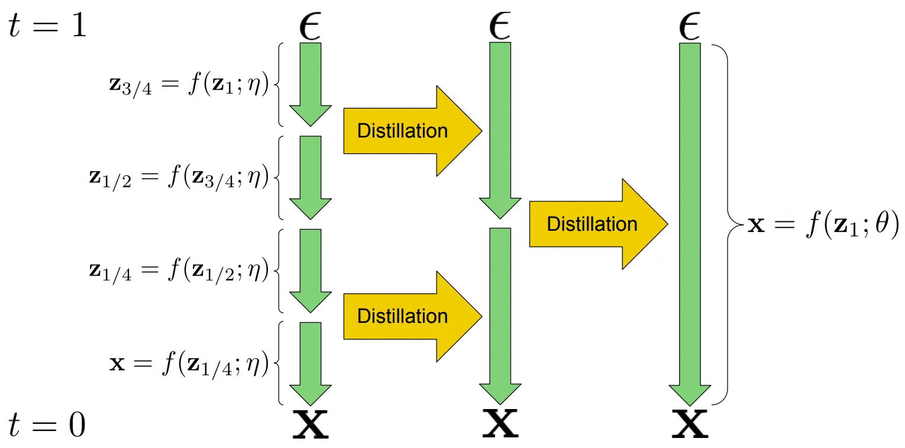
*Figure 1. Progressive distillation example, 4-step sampler -> 1-step sampler.* source: [8]

The idea is fairly intuitive, however, readers are still encouraged to check out the paper to understand the proposed alternative parameterizations ($x$, $\epsilon$, and $v$ prediction) and underlying math.

### CFG Distillation
Classifier-free guidance (CFG) is a technique proposed to increase sample quality at the cost of diversity [9]. By specifying a guidance weight ($w$), we can interpolate ($w \lt 1$) between the conditional and unconditional distributions - and extrapolate ($w \gt 1$) to push generations further towards the conditioning signal.

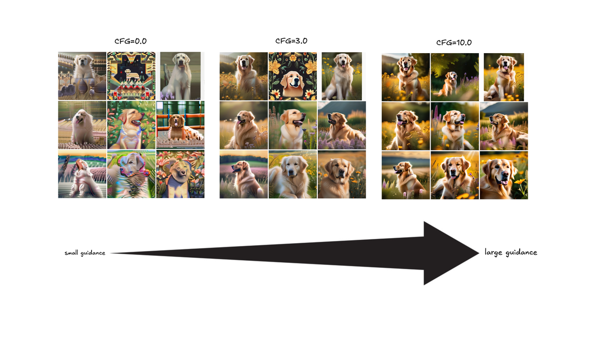
*Figure 2. CFG with different weights on SDXL.*

During training, conditioning (e.g. text prompt) is randomly dropped with some probability (typically $10\\%$ of the time). This allows the model to learn both conditional (prompt-conditioned) and unconditional ("null prompt") behavior in the same network. At inference, we evaluate the model twice per diffusion step: once with the prompt and once with the null prompt. This provides both the conditional and unconditional predictions, which are then combined using $\hat{\epsilon} = \epsilon_{\text{uncond}} + w \cdot (\epsilon_{\text{cond}} - \epsilon_{\text{uncond}})$ (reparameterization of Eq. 6 from the paper) where $\epsilon_{\text{cond}}$ and $\epsilon_{\text{uncond}}$ are the noise predictions for the conditional and unconditional inputs, respectively.

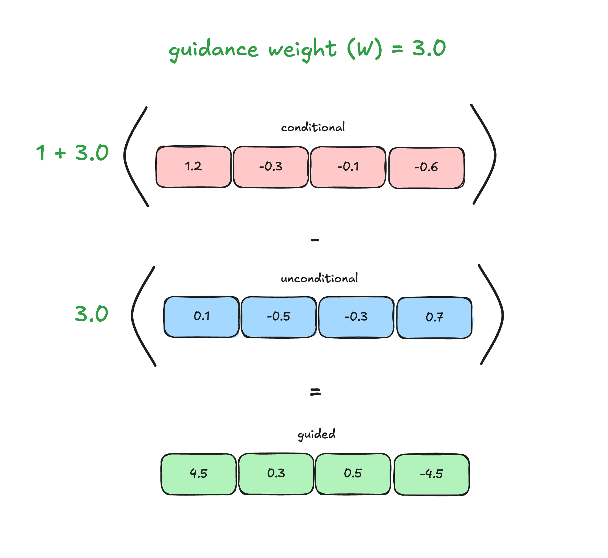
*Figure 3. CFG-guided logits. The guided logits are pushed away from the unconditional.*

Running the model twice per step is computationally expensive, so practical implementations often run it once per step with double the effective batch size to compute both conditional and unconditional outputs in parallel. However, this still increases memory usage (larger activations) and latency (typically already compute-bound). Ideally, we would like a model that directly predicts the guided output.

Meng et al. (2022) proposed and validated this idea, demonstrating its compability with progressive distillation [10]. The key tradeoff is that the distilled model is tied to a specific guidance weight $w$ used during training, losing flexibility at inference time. In practice, this is acceptable since we typically use a single fixed guidance weight (usually in the range of $5\text{-}8$).

### High-Compression VAE
Modern video models are latent diffusion models (LDMs) [11]. LDMs allow the diffusion network - including architectures such as DiT [12] and RFT [13] - to operate on compressed latents, which significantly reduces training and inference compute requirements. DC-AE (2024) explores high spatial compression ratios of up to $64\times$ (compared to conventional $8\times$ compression), further reducing the computational workload for the diffusion network [14].

Without diving too deep into the technical contributions of the paper, we can understand the value of higher-compression VAEs as follows. In transformer-based video models, the sequence length directly depends on the number of frames and spatial resolution of the VAE latent output, such that $S \propto T \times H \times W$, where $H$ and $W$ are the height and width of the compressed latent map.

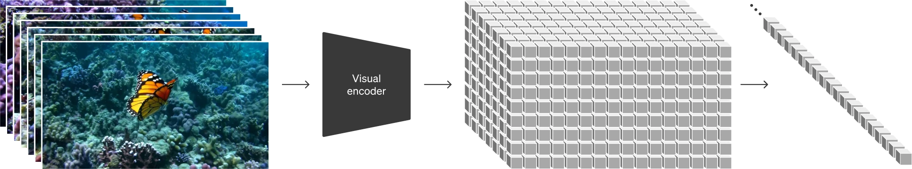
*Figure 4. Videos are VAE-encoded into a latent space, then patchified into a 1D sequence.* source: [OpenAI Sora](https://openai.com/index/video-generation-models-as-world-simulators/)

Compared to previous $8\times$ compression methods, DC-AE's $64\times$ compression reduces the sequence length by $64\times$ (due to an $8\times$ increase in both height and width compression), resulting in up to a $4096\times$ reduction in the quadratic attention computation.

### Timestep Caching
TeaCache (2024), proposed by Liu et al., is a training-free method that accelerates diffusion model inference [15]. Diffusion caching methods aim to reduce the number of computed sampling steps by reusing intermediate outputs.

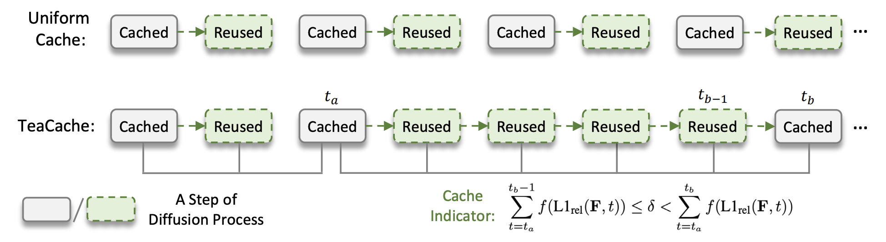
*Figure 5. Diffusion caching strategies. TeaCache selectively caches intermediate model outputs.* source: [15]

Most prior training-free methods focus on reusing intermediate features, which still requires some recomputation. In contrast, the Timestep Embedding Aware Cache (TeaCache) directly reuses intermediate model outputs by leveraging the strong correlation between a model's inputs and outputs. In particular, the authors find that timestep-embedding modulated noisy inputs (from AdaLN) exhibit similarities to corresponding model outputs. 

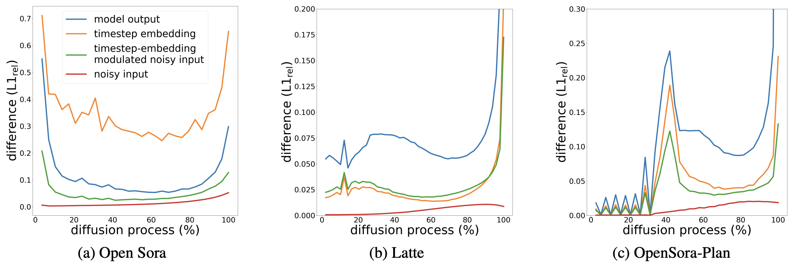

*Figure 6. Model outputs are strongly correlated with modulated noisy inputs, across different model families.* source: [15]

To determine when to cache, the authors fit polynomials between the modulated noisy inputs and model outputs. If the accumulated L1 distance between modulated inputs at two different timesteps is below a threshold, the outputs can be reused. This approach allows us to accelerate inference by $\gt 2×$ with no perceptual differences.

### Attention Sparsity
Sparsity has long been applied in deep learning to improve computational efficiency and reduce memory usage. [StreamingLLM (2025)](https://arxiv.org/abs/2309.17453) is a recent training-free framework for LLMs which utilizes a variant of Sliding Window Attention (SWA) to enable generalization to infinite sequence lengths. The authors find that alongside a dynamic sliding window, retaining the KV of initial tokens is crucial during inference due to the emergence of the attention sink. They further expand on this intuition in [their accompanying blog post](https://hanlab.mit.edu/blog/streamingllm), for curious readers.

Two recent works extend similar sparsity ideas to video generation models, also without requiring any additional training.

Sparse VideoGen (SVG, 2025) [16] proposes a method to sparsify attention computation by identifying spatial and temporal attention heads. The key intuition is that attention heads tend to specialize, attending to spatial dependencies (tokens within the same frame) or temporal dependencies (tokens at the same position across frames).

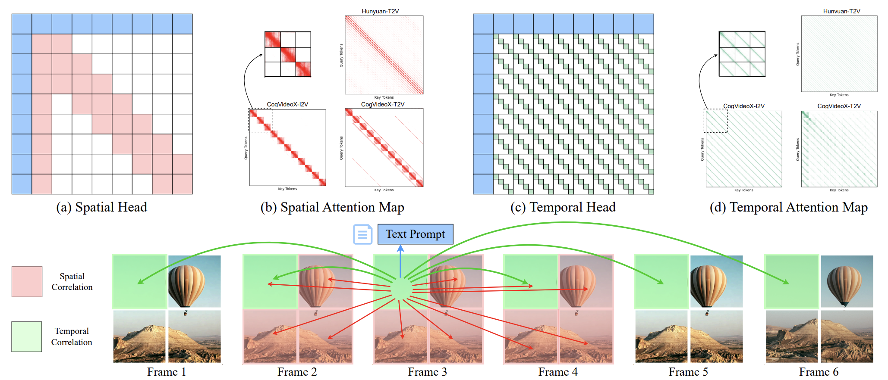

*Figure 7. Attention heads can be classified as spatial or temporal and sparsified using a corresponding mask.* source: [16]

The authors find that attention dominates computation in video diffusion transformer models. Their idea leverages spatial (block-wise) or temporal (slash-wise) attention masks to sparsify attention computation. These masks also include the text prompts and first frame, as they hold signficant attention scores for both types of heads. Heads are assigned masks using an online profiling strategy:the system samples a subset of input rows and compares the results under spatial and temporal sparsity patterns against full attention. The pattern with the lower MSE relative to full attention is selected.

These masks are coupled with a layout transformation that transposes token-major tensors into frame-major tensors. This makes tokens across different frames contiguous in memory, necessary for real-world efficiency. Empirically, SVG achieves up to a $2.33\times$ end-to-end speedup with minimal quality degradation.

AdaSpa (2025) [17] proposes a similar sparse attention method for video models that is training-free like SVG but does not require profiling. Instead, in less than 5% of full attention generation time, an online search is conducted to find an optimal sparse mask. The authors report speedups of up to $1.78\times$, outperforming SVG on their benchmarks.

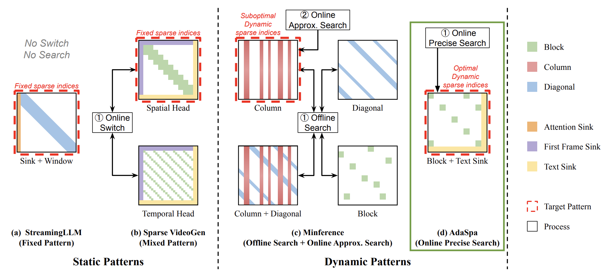

*Figure 8. AdaSpa performs an online search to find optimal sparse indices.* source: [17]

### Refiner

Cascaded diffusion models were introduced by Ho et al. (2021) [18]. A low-resolution image is first generated by a base model and then iteratively refined by subsequent super-resolution models, which provide progressively finer details.

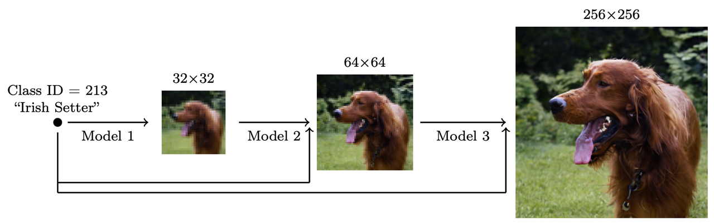

*Figure 9. Cascaded models for higher-resolution image generation.* source: [18]

Each super-resolution model is conditioned on the lower-resolution input and produces higher-resolution variant. By splitting the task into stages, this approach reduces memory and compute requirements compared to generating the high-resolution image directly within a single, monolithic model.

The same team later applied the cascaded refinement idea to video in 2022 [19], using separate spatial and temporal super-resolution models.

This cascaded refinement concept has since been incorporated into modern video diffusion models, such as the open-source [Seedance model](https://arxiv.org/abs/2506.09113).

### Quantization

Quantization allows us to compress model weights and activations from high-precision formats (e.g. FP32, BF16) into lower-precision formats (e.g. INT8, FP4). It has been historically used in two main settings:
1. Weight-only quantization (WoQ) - only model weights are quantized.
2. Weight + activation quantization - both weights and activations are quantized.

Since WoQ does not quantize activations, it primarily targets memory-bound scenarios rather than low-precision computation. During the forward pass, low-precision weights are dequantized (upcast) to the same precision as activations (e.g. BF16, FP16), and computation proceeds in high precision. Thus, WoQ reduces memory traffic but not arithmetic cost.

WoQ has been leveraged for real-world LLM inference speedups. In the memory-bound decode step, each generated token requires reading from the KV cache. In this case, throughput is limited by memory bandwidth rather than compute. Thus, quantizing weights reduces bandwidth pressure and can increase the "optimal batch size." For a deeper discussion of these dynamics, see [How To Scale Your Model](https://jax-ml.github.io/scaling-book/inference/#what-about-attention).

However, video models tend to be compute-bound (since they lack a KV cache). In this regime, WoQ offers little inference benefit. Instead, we turn to weight and activation quantization, which enables low-precision computation. By quantizing both weights and activations, operations can be executed using hardware-accelerated low-precision kernels, such as [NVIDIA's 8-bit Tensor Cores](https://www.nvidia.com/en-us/data-center/tensor-cores/), achieving higher throughput. Recent works explore post-training quantization (PTQ) for video diffusion models, requiring no additional training but sometimes needing a calibration phase to maintain accuracy.

One line of work focuses on methods that are model-architecture independent. SageAttention (2024) introduces a plug-and-play quantized attention module that directly replaces standard high-precision implementations [20]. SageAttention achieves a $2.1\times$ speedup over FlashAttention2, with almost no perceptible quality degradation compared to full precision.

Another active direction involves mixed-precision schemes. ViDiT-Q (2024) observed that aggressively quantizing all layers leads to quality loss, with certain "sensitive" layers acting as bottlenecks [21]. The authors propose preserving these layers in higher precision while quantizing others, guided by a layer-wise sensitivity analysis.

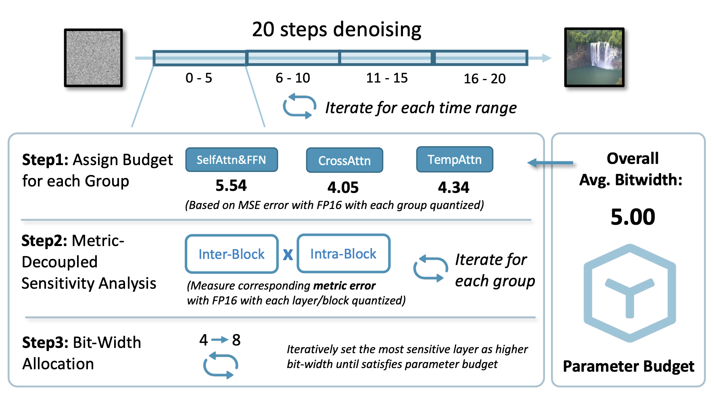

*Figure 10. ViDiT-Q's mixed-precision scheme retains sensitive layers in higher precision while quantizing others.* source: [21]

Although ViDiT-Q applies this mixed-precision scheme only to weights, the idea naturally generalizes to WXAX settings (e.g. mixed-precision W6A6/W8A8 schemes). A similar mixed-precision strategy appears in [Seedream](https://arxiv.org/abs/2509.20427) (image) and Seedance.

SVDQuant (2024) proposes a low-rank decomposition-based approach to quantization [22]. The method first reduces quantization difficulty by migrating outliers from activations to weights using techniques like [SmoothQuant](https://arxiv.org/abs/2211.10438). Then, it decomposes each weight matrix into a low-rank component and a residual component and computation proceeds as

$$XW \approx \hat{X}L_1L_2 \textbf{ (16-bit low-rank)} + Q(\hat{X})Q(R) \textbf{ (4-bit residual)}$$

where the low-rank term (which is harder to quantize) is stored in higher precision (16-bit) and the resiudal term is quantized to lower precision (4-bit).

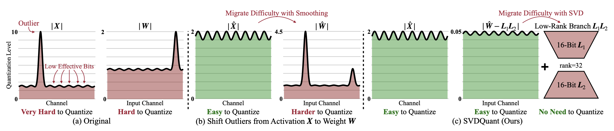

*Figure 11. SVDQuant decomposes weights into a high-precision low-rank component and a low-precision residual, reducing quantization error.* source: [22]

To enable efficient inference, the authors introduce the [Nunchaku](https://github.com/nunchaku-tech/nunchaku) engine, which fuses the low-rank Down/Up projections into the 4-bit kernel path. Without this kernel fusion, the additional DRAM transfers and kernel invocations from the low-rank branch incur a $40\\%$ latency penalty.

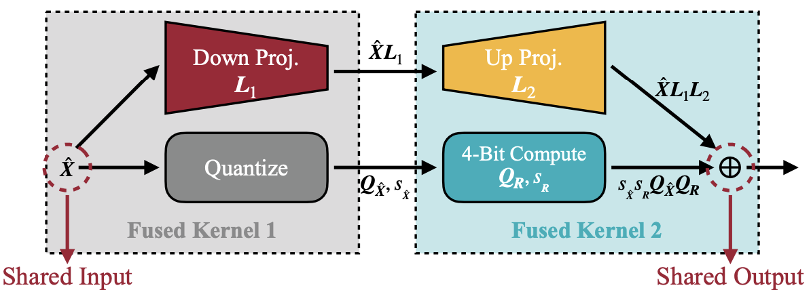
*Figure 12. Nunchaku inference engine fuses low-rank projections with the quantized branch, reducing memory traffic and latency overhead.* source: [22]

Although SVDQuant has primarily been demonstrated on image generation models, it offers a promising direction for future video quantization research.

### Autoregressive Hybrids

## Serving Optimizations
This section is more experimental than previous sections. The discussion will be primarily based off DiT-Serve and conventional LLM serving ideas.

### (Continuous) Batching

### Sequence/Context Parallelism

### Patch Parallelism

### VAE Chunking and Caching

### Model Compilation and CUDA Graphs

### Megakernels
